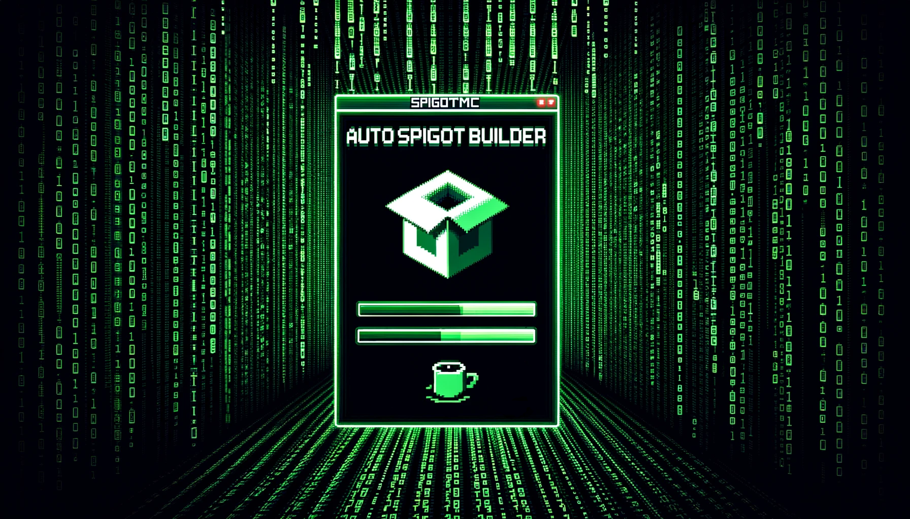
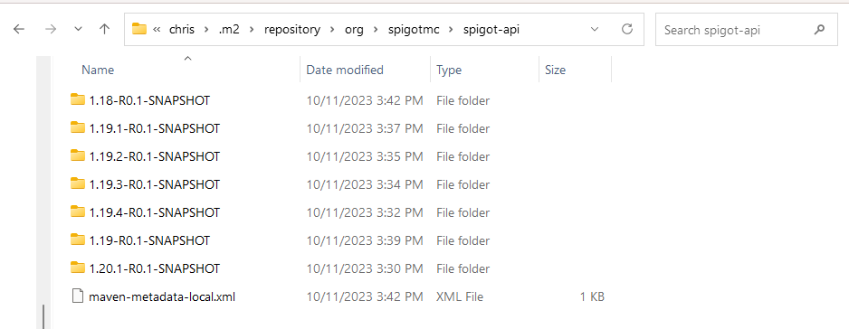

# AutoSpigotBuilder Documentation

AutoSpigotBuilder is a straightforward batch script crafted to simplify the process of building multiple Spigot versions for developers. With minimal to no setup, this script initializes a build environment, reads the desired version numbers from a file, and iteratively builds each version, all while keeping track of the progress. Its purpose is to aid developers in effortlessly obtaining the Spigot API, thereby accelerating the setup phase of their projects.

## Pre-Requisites

1. **Java**: Ensure Java 8, Java 16, and Java 17 are installed on your machine.
2. **BuildTools.jar or Curl**: Either pre-download `BuildTools.jar` from [SpigotMC BuildTools](https://www.spigotmc.org/wiki/buildtools/), or ensure Curl is installed on your machine to fetch the file automatically.
3. **Git**: For BuildTools to run on Windows, it's essential to have Git installed. It's distributed via [git-scm](https://git-scm.com/download/win) for Windows. Install it as needed, and it will provide git bash, which is used to run the BuildTools jar. Just follow the installer's prompts. Note: The latest versions of BuildTools might automatically download and install Git for you. Manually download Git only if you encounter issues.

## Configuration Files

1. **java-paths.txt**: Contains the paths to different versions of Java required for building different versions of Spigot.
2. **versions.txt**: Contains the list of Spigot versions to be built, one per line.

## Usage

1. Place the `AutoSpigotBuilder.bat` script, `java-paths.txt`, and `versions.txt` in a directory of your choice. The directory cannot be inside of OneDrive, Dropbox, or similar.
2. Open a command prompt or terminal, navigate to the directory containing `AutoSpigotBuilder.bat`.
3. Run `AutoSpigotBuilder.bat` by typing its name and hitting Enter.
4. Follow the on-screen prompts to initiate the building process.
5. The script will create a `BuildTools` directory, download the necessary build tools, and begin building each version listed in `versions.txt`.
6. The title of the command prompt or terminal window will update to show the current version being built along with the progress (e.g., "Building 1.16.5 - 3/10").

## Build Duration

Executing BuildTools to compile the necessary files may take some time, especially if you're building all 41 versions of Spigot. Refer to Usage step 6 for progress tracking details.

## Post-Completion Verification

Upon script completion, validate its successful execution by inspecting the `spigot-api` folder within your user directory. For instance: `C:\Users\%USER%\.m2\repository\org\spigotmc\spigot-api`.

## Prohibited Directories Check

The script checks if it's being run inside a Dropbox or OneDrive directory and will exit with an error message if so. This is to prevent potential syncing issues during the build process. If you wish to store the final built jars in Dropbox or OneDrive, you can copy them there after the build process completes.

## Troubleshooting

1. **Error Messages**: Pay attention to any error messages that may appear in the console. They may provide clues about any missing prerequisites or other issues.
2. **Check Java Paths**: Ensure the Java paths in `java-paths.txt` are correct and point to valid Java installations.
3. **Check Version List**: Ensure `versions.txt` contains valid Spigot version numbers, one per line.

---

For further assistance or to report issues, please create a GitHub Issue: https://github.com/CodedRedGIT/AutoSpigotBuilder/issues
